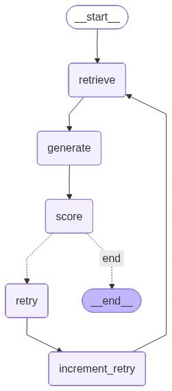

# 🤖 Self-Healing RAG Agent with LangGraph

A Self-Healing Retrieval-Augmented Generation (RAG) Agent built with LangGraph, Qdrant, Hugging Face embeddings, and LLM-as-a-Judge evaluation. <br>
This project demonstrates how to design an agentic RAG system that can:

* Detect retrieval failures
* Diagnose why the answer is bad
* Adapt its retrieval strategy automatically
* Retry intelligently until the answer quality improves

## 🚀 Key Features

* Agentic control flow with LangGraph
* Vector search using Qdrant
* Dense embeddings + cross-encoder reranking
* LLM-as-a-Judge scoring (faithfulness + relevance)
* Automatic self-healing retries
* Explainable healing trace
* Interactive Streamlit UI
* PDF-based document ingestion

## 🧠 What Is “Self-Healing RAG”?

Traditional RAG systems retrieve documents once and hope for the best.<br>
This agent instead:

* Retrieves documents
* Generates an answer
* Uses an LLM to judge the answer
* Diagnoses the failure reason:
  * irrelevant_docs
  * missing_context
* Applies a targeted fix:
  * increase retrieval budget
  * enable reranking
* Retries until the answer quality improves or a retry limit is reached
* This mimics how a human retrieval engineer would debug a failing RAG system.

## 🧩 Architecture Overview

``` pgsql
User Query
    ↓
Retrieve Documents
    ↓
Generate Answer
    ↓
LLM-as-a-Judge (Score + Failure Reason)
    ↓
Should Retry?
   ├─ No → END
   └─ Yes
        ↓
   Healing Strategy
        ↓
   Increment Retry Count
        ↓
   Retrieve Again (Improved)
```
## Graph Visualization



## 🧠 Failure Modes Detected

| Failure Reason | Meaning | Healing Action |
| --- | --- | --- |
| irrelevant_docs | Retrieved docs don’t match query | Enable reranking + increase budget |
| missing_context | Docs are related but insufficient | Increase retrieval budget + rerank |
| none | Answer is good | Stop execution |

## 📂 Project Structure

```bash
Self-Healing-RAG/
│
├── langgraph_agent/
│   ├── document_loader.py   # PDF loading + chunking
│   ├── retrieve_docs.py     # Embedding, retrieval, reranking, LLM judge
│   ├── nodes.py             # LangGraph nodes + state definition
│   └── graph.py             # LangGraph control flow
│
├── app.py                   # Streamlit application
└── README.md
```

## 🛠️ Tech Stack

* LangGraph – agentic workflows
* LangChain – document loading & splitting
* Qdrant – vector database
* FastEmbed – Hugging Face embeddings
* Cross-Encoder Reranker – relevance refinement
* Any OpenAI-compatible chat API – answer generation and LLM-as-a-Judge
* Ollama – local open source chat models, with no hosted LLM key required
* Streamlit – UI

### Dependencies

* `fastembed` >= 0.7.4
* `hf-xet` >= 1.2.0
* `ipykernel` >= 7.1.0
* `langchain-community` >= 0.4.1
* `langchain-huggingface` >= 1.2.0
* `langchain-text-splitters` >= 1.1.0
* `langgraph` >= 1.0.5
* `numpy` >= 2.4.0
* `openai` >= 2.14.0 (used as the client for OpenAI-compatible APIs, including Ollama)
* `pypdf` >= 6.5.0
* `qdrant-client` >= 1.16.2
* `sentence-transformers` >= 5.2.0
* `streamlit` >= 1.52

## 🧪 How the LLM-as-a-Judge Works

The evaluator LLM receives:

* User query
* Retrieved documents
* Generated answer

It returns structured JSON:

```json
{
  "relevant_docs": true,
  "sufficient_context": false,
  "score": 0.62
}
```


This output directly controls the agent’s next action.

## 🧾 State Managed by the Agent

```python
class RAGState(TypedDict):
    text: List[str]
    query: str
    retrieved_docs: List[str]
    retrieval_mode: str
    retrieval_budget: int
    answer: str
    score: float
    failure_reason: str
    retry_count: int
    max_retries: int
    healing_trace: List[str]
```

This explicit state design makes the system:

* debuggable
* explainable
* extensible

## 🔌 Model providers

The model provider, endpoint, API key, and model names are configured in the Streamlit sidebar. The app uses the OpenAI chat completions API format, which is supported by OpenAI and many hosted inference providers. Choose **OpenAI-compatible API** and enter the provider's compatible base URL, key, and model ID. Generation and judge model IDs can be different.

For local open source models, install [Ollama](https://ollama.com), start its service, and pull a model, for example:

```bash
ollama pull llama3.2
```

Then choose **Ollama** in the sidebar. The default endpoint is `http://localhost:11434/v1`; enter the model name exactly as shown by `ollama list`. Ollama does not require an API key. You can use the same model for generation and judging or select a separate model for each.

This supports OpenAI-compatible endpoints. Providers that only expose a different, non-compatible API protocol need an adapter before they can be used.

## ▶️ Running the App

### 1️⃣ Install dependencies

```bash
pip install -e .
```

This installs the dependencies declared in `pyproject.toml`. The embedding and reranking models are downloaded from Hugging Face on first use.

### 2️⃣ Run Streamlit

```bash
streamlit run app.py
```

### 3️⃣ Usage

1. Choose OpenAI, Ollama, or an OpenAI-compatible API and configure its model(s)
2. Upload a PDF document
3. Ask questions about the document
4. Watch the agent:

* retrieve
* evaluate
* self-heal
* retry

## 🔍 Example Healing Trace

```yaml
Irrelevant docs → enabled rerank + increased retrieval budget by 2
Missing context → increased retrieval budget by 3 + rerank
```

This makes the agent’s reasoning transparent and inspectable.

## 🎯 Why This Project Matters

This repo demonstrates real-world RAG engineering, not toy demos:

* Explicit failure modeling
* Adaptive retrieval strategies
* Agentic decision-making
* LLMs used for control, not just generation

It is ideal for:

* Portfolio projects
* RAG system interviews
* Agentic AI experimentation
* Production design discussions

## 🔮 Possible Extensions

* Query rewriting
* Hallucination detection
* Hybrid BM25 + dense retrieval
* Multi-document routing
* LangSmith tracing
* Evaluation dataset logging

## 👤 Author

Designed with ❤️ by Gustavo R. Santos<br>
🔗 https://gustavorsantos.me

## License

Project licensed under the MIT License.

---

## Observations

### 1. A Little About LangGraph

LangGraph = *“A directed graph where nodes mutate shared state, and edges depend on that state.”*

#### Core Mental Model (Burn This In)

* Every LangGraph project answers four questions:
* What is my state?
* Which nodes modify which parts of the state?
* Which decisions depend on the state?
* When does the graph stop?
